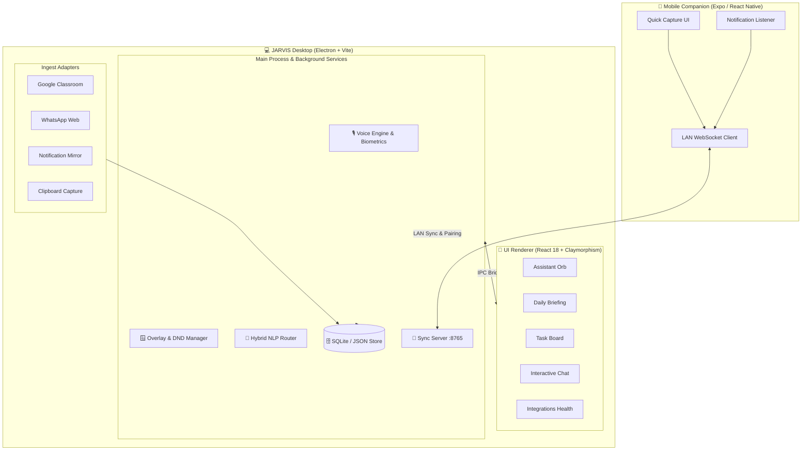

# 🤖 JARVIS — Voice-Locked, Invisible AI Desktop Assistant

<p align="center">
  
  
  
  
  
  
  
</p>

---

## 🌟 Overview

**JARVIS** is an ultra-fast, biometric-secured, invisible personal desktop assistant engineered with **Electron, React 18, TypeScript, and modern Claymorphism**. It is designed to seamlessly organize your academic and daily workflow by ingesting deadlines from multiple channels (Google Classroom, WhatsApp, phone notifications, and clipboard selections), while remaining silent and unobtrusive during gaming or deep work sessions.

---

## ⚡ Key Highlights

### 🎙️ 1. Voice-Locked Biometric Recognition
* **Porcupine Wake Word**: Ultra low-power wake phrase listener (*"Hey JARVIS"*).
* **Eagle Acoustic Voiceprint Verification**: Biometric speaker enrollment (8-sample acoustic voiceprint profile). Rejects unauthorized voices using cosine similarity scoring (threshold $\ge 0.85$).
* **Privacy-First**: Audio analysis and voiceprints are computed and persisted locally in SQLite. No raw audio ever leaves your computer.
* **Native TTS & Visual Feedback**: Integrated text-to-speech synthesis with real-time waveform and audio level indicators.

### 🪟 2. Invisible Overlay & Smart Distraction Shield
* **Global Hotkey Summon**: Press `CmdOrCtrl + Shift + Space` (or `Alt + J`) to instantly bring up the floating assistant overlay.
* **DND & Fullscreen Suppression**: Automatically detects fullscreen games, videos, or scheduled quiet hours. Intrusive notifications are buffered in a local backlog queue and delivered when you return.
* **System Tray Resident**: Quick menu actions for toggling listening, opening settings, or running quick captures.

### 🔌 3. Multi-Source Ingest Adapters
* 📚 **Google Classroom Sync**: RFC 8252 loopback OAuth 2.0 flow to pull course materials, assignments, and due dates into structured tasks.
* 💬 **WhatsApp Web Extraction**: Intelligent text parsing for homework announcements and assignment deadlines.
* 📱 **Mobile Notification Mirror**: Real-time WebSocket connection to mirror mobile alerts from Android/iOS.
* 📋 **Global Clipboard Quick Capture (`CmdOrCtrl + Shift + J`)**: Highlight text anywhere on your OS to automatically extract dates and actions via `chrono-node`.
* 🩺 **Integrations Health Monitor**: Live telemetry displaying connection status, sync history, and one-click re-authorization.

### 🧠 4. Hybrid Local/Cloud NLP & Semantic Memory
* **Multi-Tiered Query Engine**:
  1. Instant regex entity extraction and natural language date parsing (`chrono-node`).
  2. Prototype semantic matching for instant system controls.
  3. Local Ollama LLM (`llama3.2`, `mistral`, `phi3`) for offline privacy.
  4. Cloud LLM fallback (Claude 3.5 Sonnet / Anthropic API) when configured.
* **Local RAG Vector Store**: 64-dimensional semantic text embeddings with cosine search for instant recall of facts, notes, and past tasks.

### 📱 5. Mobile Companion App
* Built on **React Native (Expo 51)**.
* Fast local LAN pairing over port `8765` using secure 6-digit PIN handshake.
* On-device notification listener and mobile task capture.

### 🎨 6. Claymorphism Design System
* Soft multi-layered inner/outer clay shadows, pastel color palettes, tactile switches, and the dynamic multi-state **AssistantOrb** (`idle`, `listening`, `thinking`, `speaking`).

---

## 🏗️ System Architecture



---

## 🚀 Getting Started

### Prerequisites
* **Node.js**: v18.0.0 or higher (v20+ recommended)
* **npm**: v9.0.0 or higher
* **Git**

### 1. Installation

```bash
# Clone the repository
git clone https://github.com/MoulendraBalaji/Jarvis_Assistant.git
cd Jarvis_Assistant

# Install Desktop dependencies
npm install

# Install Mobile Companion dependencies
cd companion-app
npm install
cd ..
```

---

### 2. Development Mode

```bash
# Start the Desktop app with Hot Reloading (Vite + Electron)
npm run dev
```

To run the Mobile Companion app:
```bash
cd companion-app
npm run start
```

---

### 3. Production Build & Packaging

```bash
# Check TypeScript types
npm run typecheck

# Build Desktop production bundle
npm run build

# Package standalone installers
npm run package:win     # Windows (.exe installer & portable)
npm run package:mac     # macOS (.dmg / .zip)
npm run package:linux   # Linux (.AppImage / .deb)
```

Packaged installers and executables will be generated in the `release/` directory.

---

## ⌨️ Global Hotkeys

| Shortcut | Action | Scope |
| :--- | :--- | :--- |
| `CmdOrCtrl + Shift + Space` | Summon / Hide JARVIS Overlay | System-wide |
| `Alt + J` | Alternative Toggle Overlay | System-wide |
| `CmdOrCtrl + Shift + J` | Quick Capture Selected Text to Task | System-wide |

---

## ⚙️ Environment Configuration

Create a `.env` file in the root directory (see [`.env.example`](file:///.env.example)):

```env
# AI & LLM Endpoints
ANTHROPIC_API_KEY=your_anthropic_api_key_here
JARVIS_OLLAMA_URL=http://127.0.0.1:11434

# Voice & Biometrics (Picovoice Porcupine / Eagle)
PICOVOICE_ACCESS_KEY=your_picovoice_access_key

# Integrations (Google Classroom OAuth 2.0)
GOOGLE_CLIENT_ID=your_google_client_id
GOOGLE_CLIENT_SECRET=your_google_client_secret

# Device Sync
JARVIS_SYNC_PORT=8765
```

---

## 📁 Repository Structure

```
Jarvis_Assistant/
├── electron/                   # Electron Main & Preload Processes
│   ├── auth/                   # OAuth2 Loopback Handlers
│   ├── ipc/                    # Type-Safe IPC Channel Registrations
│   ├── services/               # Background Services & Ingest Adapters
│   │   ├── adapters/           # Classroom, WhatsApp, Notification Ingest
│   │   ├── voice/              # Porcupine & Eagle Voice Engines
│   │   ├── db.ts               # SQLite / JSON Fallback Database
│   │   ├── overlay.ts          # Window State Machine & DND Manager
│   │   └── router.ts           # Hybrid NLP Intent Classifier
│   ├── main.ts                 # Main Process Entry Point
│   └── preload.ts              # CommonJS Context Bridge Preload
├── src/                        # React 18 Renderer Process
│   ├── components/             # Claymorphic UI Components & AssistantOrb
│   ├── design-system/          # Clay Tokens, Buttons, Inputs, Cards
│   ├── lib/                    # Client IPC Proxies & API Fallbacks
│   ├── store/                  # Zustand Global State Stores
│   ├── App.tsx                 # Core Dashboard Shell
│   └── main.tsx                # React Mount with Error Boundary
├── companion-app/              # React Native (Expo) Mobile Companion
│   ├── screens/                # Mobile Pairing & Quick Capture Views
│   ├── services/               # LAN WebSocket Handshake & Listeners
│   └── package.json            # Expo App Dependencies
├── shared/                     # Shared TypeScript Interfaces & Types
├── electron-builder.yml        # Multi-Platform Packaging Specs
├── electron.vite.config.ts     # Electron-Vite Bundler Configuration
├── tsconfig.json               # Root TypeScript Configuration
└── package.json                # Project Manifest
```

---

## 🛡️ Privacy & Security

* **100% Local Storage**: All tasks, history, notes, and biometric embeddings are saved directly on your device.
* **Biometric Protection**: Speaker voiceprints are stored as numeric vectors without retaining raw audio files.
* **Local LAN Communication**: Device synchronization between your desktop and mobile companion runs strictly over your local Wi-Fi network with PIN encryption.

---

## 📄 License

Distributed under the **MIT License**. See `LICENSE` for more information.

---

<p align="center">
  Crafted by <b>Moulendra Balaji</b>
</p>
